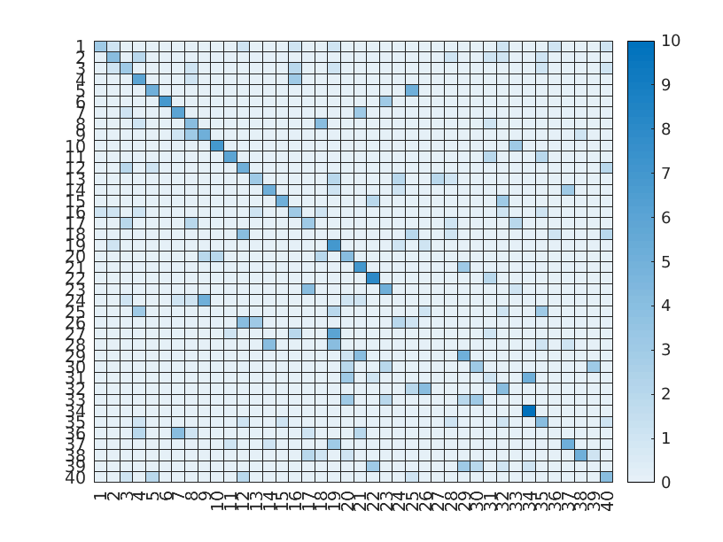
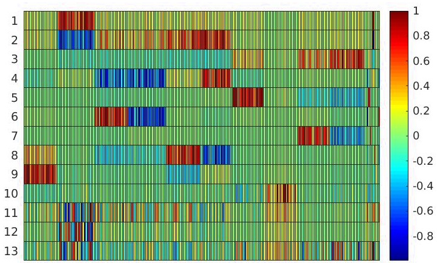
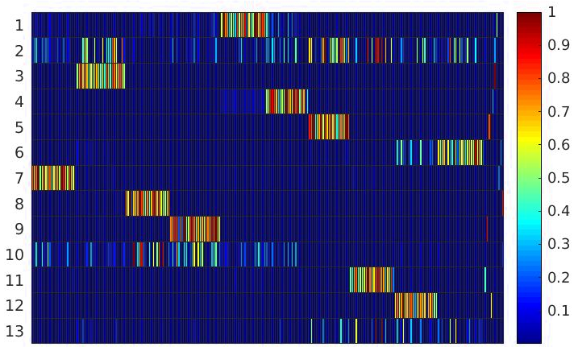

# Experiments on the Tucker decomposition

This repository gathers several experiments showing the capabilities of the Tucker decomposition for data analysis. Two major algorithms are studied, the Higher-Order Orthogonal Iteration (HOOI) and the Hierarchical Alternating Least Squares (HALS-NTD).

## Dependencies

[tensortoolbox](https://www.tensortoolbox.org/) v3.2.1

## Datasets used

The experiments are conducted on two datasets:
- [The Database of Faces (AT&T)](https://cam-orl.co.uk/facedatabase.html): contains greyscale images of 40 subjects. Each subject has 10 images of size 92x112. This dataset is often used to test face recognition algorithms.
- [The primary school dataset](http://www.sociopatterns.org/datasets/primary-school-cumulative-networks/): contains the interactions among persons in a primary school. There are 242 persons, including 10 teachers, and the students are split in 10 classes (2 for each grade). The dataset also contains temporal indications regarding the timestamp of the interaction. Interactions are recorded if they last at least 20 seconds.

## Summary of the results obtained

Through these experiments, two aspects of each algorithm of the Tucker decomposition are evaluated:
1. The capability to custer data.
1. The ease to interpret directly the result of the decomposition.

The first aspect is evaluated through the Database of Faces, and the second aspect is evaluated through the primary school dataset.

### Capability to cluster data

The capability to cluster data is tested with the database of faces. A 3-order tensor is built with one dimension for the images, and the two other can be seen as a matrix that contains the image. The Tucker decomposition is executed, and the k-means algorithm is applied on the factor matrix of the dimension of the images with k=40 (one cluster per subject).

The first figure represents the confusion matrix for the algorithm HOOI, and the second figure the one for the HALS-NTD algorithm. The lines represent the expected cluster, and the columns the obtained clusters. The value indicate the number of images. Thus, the value on the diagonal gives the number of images in the correct cluster.  

The HOOI algorithm produces better results than the HALS-NTD algorithm. This can be explained by the orthogonality constraint on the factor matrices brought by the SVD. The following table summarizes the accuracy measures obtained after having executed the k-means 100 times.

| Measure  | HOOI  | HALS-NTD  |
|---|---|---|
| Minimum  | 0.5425  | 0.2425  |
| Maximum  | 0.7175  | 0.38  |
| Mean  | 0.6122  | 0.3184  |
| Median  | 0.61  | 0.32  |

### Ease to interpret the result

To compare the two algorithms we execute the Tucker decomposition on the primary school dataset with ranks 13, 13 and 4. We then dislay the factor matrix corresponding to the first dimension, for both algorithm.

The first figure is the one for the HOOI algorithm, and the second figure is for the HALS-NTD algorithm. The lines are the ranks of the matrix, and the columns are the students, sorted depending on their class (the first columns are for the students of the class 1A, then 1B, and so on until 5B). The teachers are the last 10 columns.

The HALS-NTD produces more directly interpretable results. We can distinguish 10 ranks that represent the classes, and 3 more ranks with heterogeneous students that appear mainly during the break hours (the factor matrix corresponding to the time dimension helps to interpret this part).

The HOOI is harder to interpret, because it produces positive and negative values, and the classes appear less clearly.
